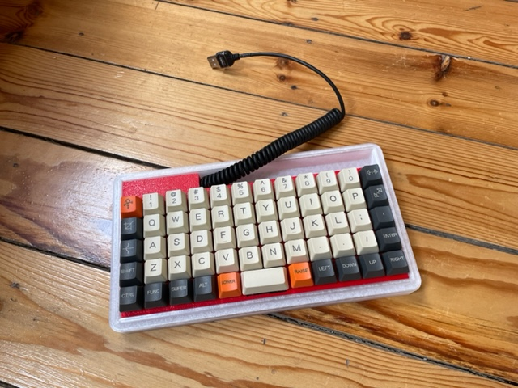
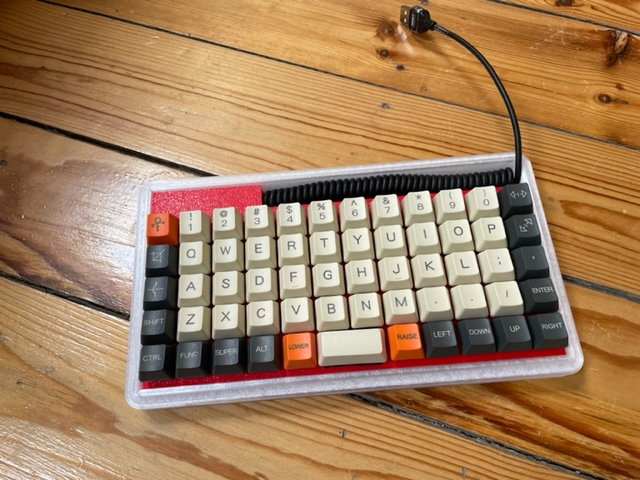

Introduction
============

USB cable loose:



USB cable tucked away:



The cyberdeck keyboard has:
- JJ50 keyboard backplate
- 59 Cherry green mechanical switches
- 60 red leds
- 5 M2 self tapping screws
- USB kabel Datakabel laadkabel rekbaar spiraalkabel

The keyboard needs 2 3D printed parts:
- bottom case, which will be also the lid of the Cyberdeck. Here it is printed in transparant PETG to give the glowing LEDs on the bottom their nice effect.
- keyboard plate for the switches. The switches need to be soldered on JJ50 backplane. Afterwards the keyboard plate is screwed onto the bottom plate.

Every switch has also its own red led.

Red is the theme here to build the Cherry-Pi cyberdeck.

Improvements:
-------------

This is a kind of todo:

1) Bottom case: Tilt mechanism to tilt the keyboard. Idea: use the hinches to the cyberdeck as a way to tilt it. Can be glued on it afterwards.
2) Keyboard-plate: extract parts on the side to show more of the bottom leds
3) bottom case and keyboard plate: minimize the height (keyboard plate is at 20 mm height from the table)

Building:
---------

### Compiling

references:
- https://beta.docs.qmk.fm/tutorial/newbs_getting_started

### flashing

```
sudo bootloadHID Downloads/jj50_test_jj50.hex
```

BootloadHID flashing jj50
- https://beta.docs.qmk.fm/using-qmk/guides/flashing/flashing_bootloadhid

references:
- https://beta.docs.qmk.fm/using-qmk/guides/flashing/flashing_bootloadhid


### Testing

#### Switches

The MO (7, 4, 5) switches don't show up in the qmk configurator and tester. So to test the switches we will allocate them to some keys from the keypad (1,2,3).

1) in the config.qmk.fm we select the jj50 and load default.
2) Select the MO 7 and click on '1' of the keypad
3) Select the MO 4 and click on '2' of the keypad
4) Select the MO 5 and click on '3' of the keypad

When flashed you can test the switches after removal en reinserting the keyboard. Take into account the MO keys are mapped to the keypad.
To test the keyboard use the keyboard tester of config.qmk.fm and compare it with the layout. It is simpler you print the layout in one browser and open the tester in another browser.
One by one you short the switch to see the correct key lights up.

Note:
* THIS ONLY FOR TESTING THE KEYBOARD TO SEND IT BACK IN CASE OF PROBLEMS !!! *
You need to reflash it afterwards with the default jj50 or your custom firmware.

#### LEDs

The leds underneat will turn on when flashed.

In bootloader mode all leds flashes. So you can test them one-by-one.
The leds underneat are turned off in bootloader mode.


References & parts
------------------

### Ali Express

- Jj50 V1.0 Custom Mechanische Toetsenbord 50% Pcb Geprogrammeerd 50 Preonic Layouts Bface Firmware Met Rgb Bodem Underglow Led (30.67$) https://nl.aliexpress.com/item/32848915277.html?gatewayAdapt=glo2nld&spm=a2g0o.order_list.0.0.21ef79d2P7f0q6
- 7 * 10Pcs/pack Mechanical Keyboard Switch Gateron MX3 Pin Green Switch Transparent Case for Mechanical Keyboard Cherry MX Compatible (17.64$) (https://nl.aliexpress.com/item/1005001728721678.html?gatewayAdapt=glo2nld&spm=a2g0o.order_list.0.0.21ef79d2P7f0q6)


### Amazon

- 800 Stück M2 schwarzer Kohlenstoffstahl mit Senkkopf und flachem Kreuzkopf, selbstschneidende Schrauben, Maschinenschrauben, Befestigungselemente, Reparaturwerkzeuge (13.99€) (https://www.amazon.de/gp/product/B07RYLM9N2/ref=ppx_yo_dt_b_asin_image_o01_s00?ie=UTF8&psc=1)
- Systeem-S Mini USB kabel Datakabel laadkabel rekbaar spiraalkabel met 90 ° (8.15€) (https://www.amazon.de/gp/product/B00JR6TDTM/ref=ppx_yo_dt_b_asin_title_o05_s00?ie=UTF8&psc=1)
- YIXISI 600 stuks 3 mm LED lichtdiode, LED diodes set, ronde kop LED, 5 kleuren (9.99€) (https://www.amazon.de/gp/product/B08FJ63WKS/ref=ppx_yo_dt_b_asin_title_o05_s01?ie=UTF8&th=1)
- YMDK Carbon-Tastenkappen mit Lasergravur, 1,5 mm PBT für MX Switches Planck Niu40 Preonic Keyboard (17.74€) (https://www.amazon.de/gp/product/B07JKTQJQ7/ref=ppx_yo_dt_b_asin_title_o03_s00?ie=UTF8&th=1)